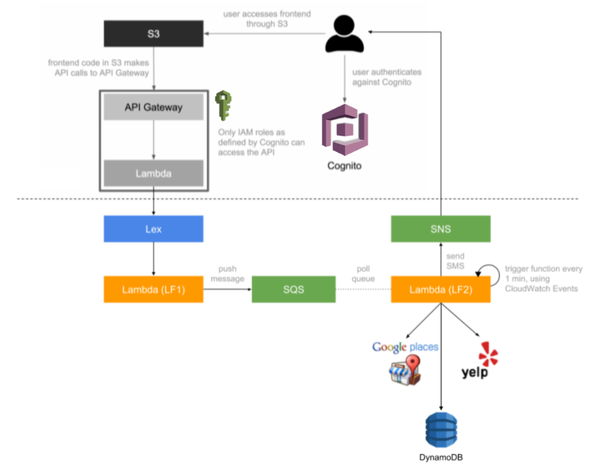

## Dining Concierge Chatbot

Customer Service is a core service for a lot of businesses around the world and it is getting disrupted at the moment by Natural Language Processing-powered applications.
In this repository, we have implemented a serverless, microservice-driven web application.

We have built a Dining Concierge chatbot, that will SMS you restaurant suggestions given a set of preferences like location, type of food, number of people etc. that the user gives the chatbot through conversation. We have used Google Maps API and AWS services like Lex, Cognito, SQS, SNS, DynamoDB etc to create the entire application.

## Architecture

The architecture followed while making the application is shown below:




## Installation

To run the code do:

```bash
npm install
npm install aws-api-gateway-client
npm install --save amazon-cognito-identity-js
npm install aws-sdk
npm start
```

## Contributors
This project was made by [Prerna Kashyap](https://github.com/prerna135) and [Siddhant Gada](https://www.github.com/SiddhantGada) 
